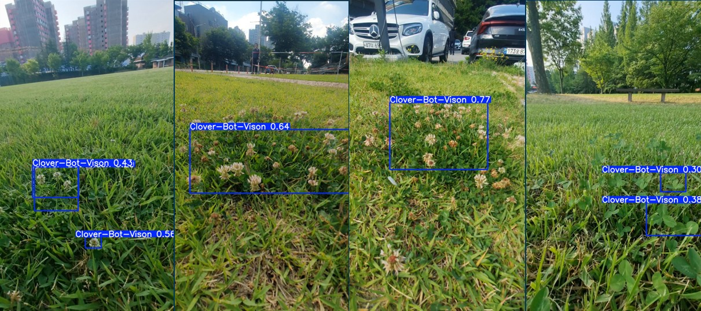

# 🍀 지도학습 머신러닝으로 잔디밭 잡초 구별하기 (feat. 클로버)

> 선택적 제초로봇을 위한 클로버 탐지 모델 개발 프로젝트

### 발표일: 2026년 6월 16일

---

## 📌 프로젝트 개요

골프장, 리조트, 공원, 경기장 등에서 사용되는 **선택적 제초로봇**은 아직 초기 상용화 단계에 머물러 있습니다. 본 프로젝트는 잔디밭에서 가장 빈번하게 발생하는 잡초인 **클로버**를 타겟으로, RC카 기반 하드웨어와 YOLOv8 객체 탐지 모델을 결합하여 클로버를 실시간으로 인식하는 시스템을 구현합니다.

### 핵심 제초 기술 배경

| 방식 | 설명 |
|---|---|
| 레이저 방식 | 잡초의 생장점을 제거 |
| 정밀 분사 방식 | 잡초에만 선택적으로 제초약 살포 |

---

## 🛠 하드웨어 사양

| 구성 | 사양 |
|---|---|
| 몸체 | RC카, Arduino 4WD 플랫폼 |
| 카메라(눈) | Arducam, 100° 광각 시야각(FOV) |
| 타겟 잡초 | 클로버 (잔디밭 주요 잡초 발생 순위 1위) |

---

## 📊 데이터 수집 및 선정

### 기존 공개 데이터셋의 한계
- Kaggle 등 공개 데이터는 대부분 위에서 아래로 내려다본(Top-down) 사진
- RC카의 낮은 눈높이 시점과 불일치 → 직접 촬영 결정

### 직접 촬영
- **장소**: 광주인력개발원 옆 축구장
- **장비**: 갤럭시 S21, 0.5배 초광각 모드 (Arducam 화각 동기화)
- **카메라 높이**: 25cm / **촬영 각도**: 하향 15도
- **촬영 경로**: 클로버 군집을 따라 폐곡선 형태로 좌회전 이동
- **수집량**: 위치별 동영상 5개

---

## 🧹 데이터 전처리

1. **프레임 추출 (Google Colab)**: 동영상 5개를 1초당 2프레임으로 분할 → 총 **2,068장** 이미지 자동 생성
2. **정밀 선별**: 각 촬영 위치에서 40장씩, 총 **200장** 선별

---

## 🏷 데이터 라벨링 및 증강

1. **라벨링 (Roboflow)**: 선별된 200장에 Bounding Box로 클로버 위치 지정
2. **증강(augmentation)**: 밝기 조절 및 좌우 반전 기법 적용
   - 200장 → **600장**으로 확대
   - 다양한 조도·방향 변화에 강건한 모델 구현 목표

---

## 🤖 모델 학습

| 항목 | 내용 |
|---|---|
| 모델 | YOLOv8n |
| 학습 방식 | 지도학습 (Supervised Learning) |
| 학습 환경 | Google Colab (T4 GPU) |
| Epochs | 50회 |
| Img Size | 640 |
| 산출물 | 학습된 가중치 `best.pt` |

---

## 📈 결과

- **Test Set 탐지 인식률**: 약 30% ~ 77% 범위
 
- **실시간 검증**: Ultralytics 플랫폼을 활용해 스마트폰으로 실시간 클로버 인식 테스트 진행 (정상 검출 / 오검출 케이스 확인)
 

---

## 💭 결론 및 고찰

**성과**
- 직접 수집한 데이터로 지도학습 기반 가중치 모델 학습 완료
- 양질의 데이터 확보를 위한 고민과 시행착오 과정 경험
- 오프라인에서 작동하는 안드로이드 애플리케이션 제작

**한계 및 향후 과제**
- 촬영 환경 변화에 따른 오검출 발생
- 형태가 유사한 식물과의 혼동(오인식)
- 라즈베리파이와의 통신 구현 과제 남음

---

## 🎬 데모 영상

안드로이드 앱 시연 영상: [YouTube Shorts 바로가기](https://youtube.com/shorts/BP7Pazm5U9k)
